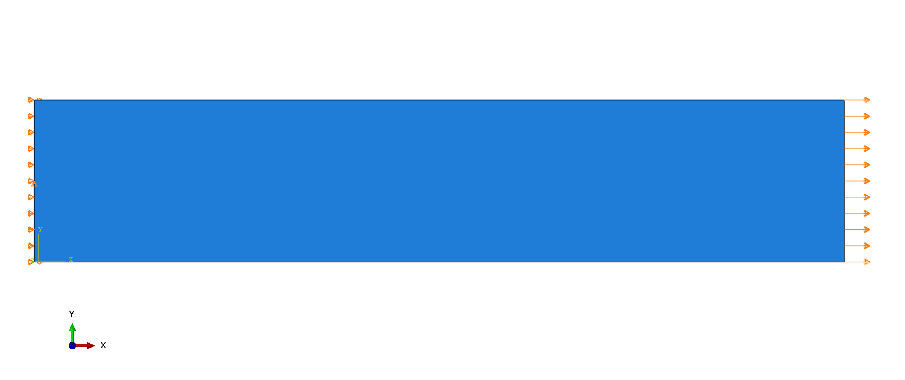
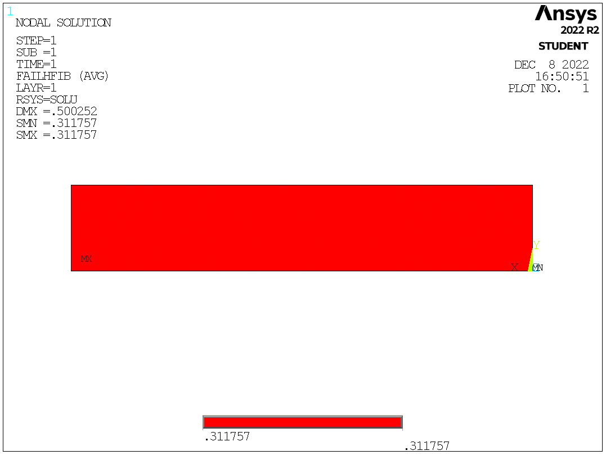
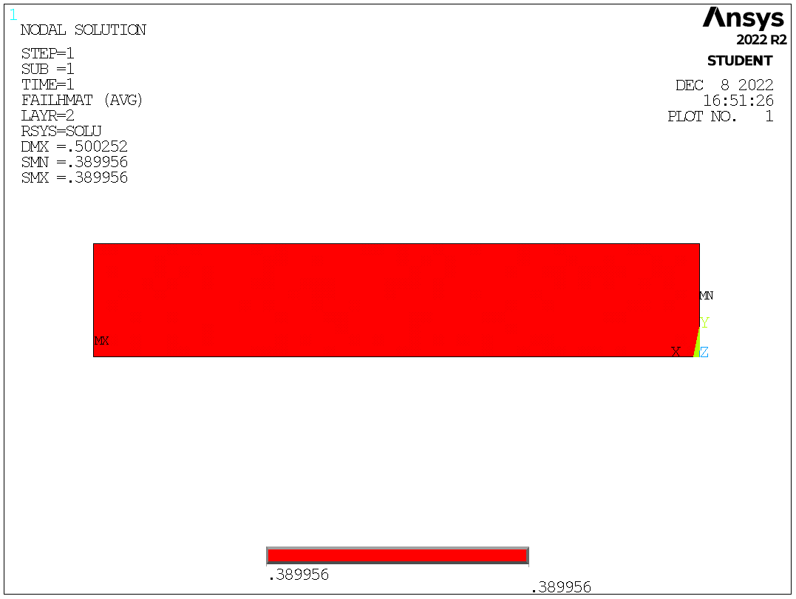
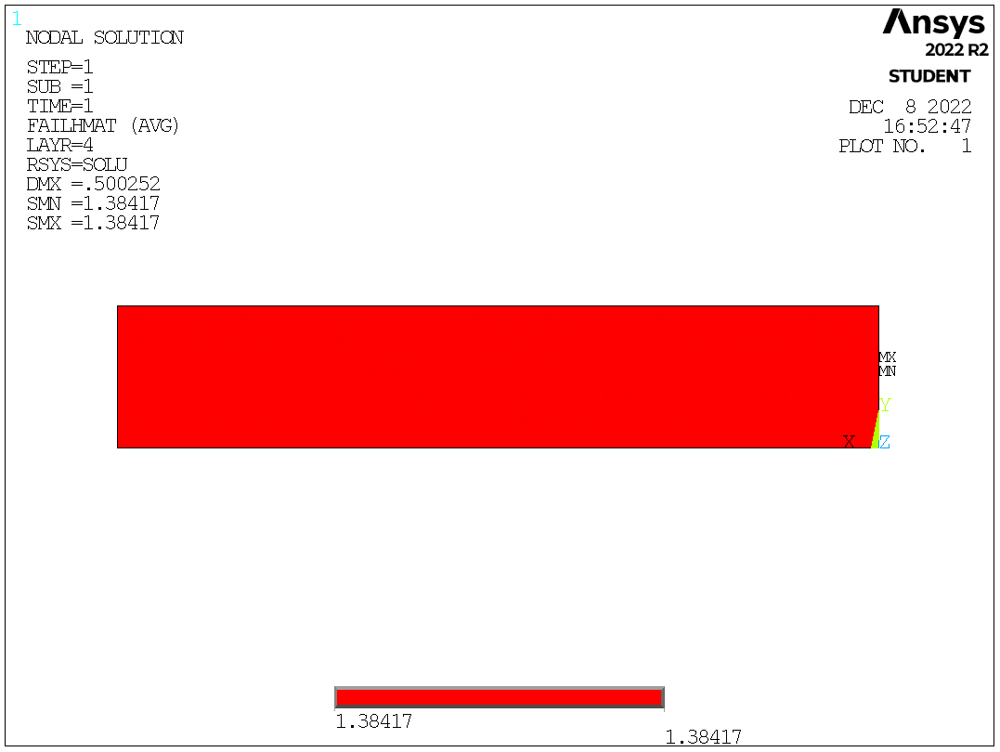
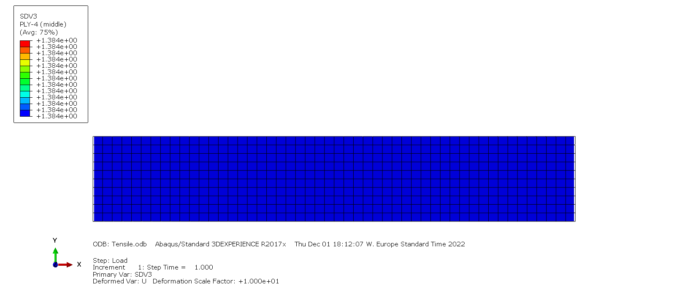

# Abaqus-Hashin-3D-Subroutines

# Input to the Model

The following properties need to be entered in the following order.
  * Youngs Modulus in 11 Direction $E_{11}$
  * Youngs Modulus in 22 Direction $E_{22}$
  * Youngs Modulus in 33 Direction $E_{33}$
  * Poisson's Ratio in 1-2 Plane $\nu_{12}$
  * Poisson's Ratio in 1-3 Plane $\nu_{13}$
  * Poisson's Ratio in 2-3 Plane $\nu_{23}$
  * Inplane Shear Modulus $G_{12}$
  * Inplane Shear Modulus $G_{13}$
  * Inplane Shear Modulus $G_{23}$
  * Longitudinal Strength in 11 Direction $X_T$
  * Compressive Strength in 11 Direction $X_C$
  * Longitudinal Strength in 22 Direction $Y_T$
  * Compressive Strength in 22 Direction $Y_C$
  * Inplane Shear Strength $S_{12}$
  * Transverse Shear Strength $S_{23}$
  
# Output Visualization
 
There are five solution-dependent state variables. They are as follows
  * SDV1 : Fiber Failure in Tension
  * SDV2 : Fiber Failure in Compression
  * SDV3 : Matrix Failure in Tension
  * SDV4 : Matrix Failure in Compression
 
# Verification

|  | 
|:--:| 
| *FE Model and Boundary Conditions* |

A simple tensile test is performed to check the working of the UMAT. The specimen dimensions are 100mm x 10mm. The ply layup is $[0/+45/-45/90]_s$, and each ply is 0.125mm thick. The left end of the specimen is fixed in X, Z, ROTX, ROTY, and ROTZ, and the middle of the left end is fixed in Y. A displacement of 0.15mm is applied on the right end. The material properties are
* $E_{11}$ = 135e3 MPa
* $E_{22}$ = $E_{33}$ = 10e3 MPa
* $\nu_{12}$ = $\nu_{13}$ = 0.25
* $\nu_{23}$ = 0.45
* $G_{12}$ = $G_{13}$ = 4.3e3 MPa
* $G_{23}$ = 3e3 MPa
* $X_T$ = 2410 MPa
* $X_C$ = 1300 MPa
* $Y_T$ = 86 MPa
* $Y_C$ = 200 MPa
* $S_{12}$ = 152 MPa
* $S_{23}$ = 100 MPa

A comparison between the results of Ansys and Abaqus UMAT for the dominant failure mode in each ply is shown. The results do match accurately.

### Ply 1
|     Ansys       |      Abaqus Hashin3D.for
:-------------------------:|:-------------------------:
 |  

### Ply 2
|     Ansys       |      Abaqus Hashin3D.for
:-------------------------:|:-------------------------:
 |  

### Ply 3
|     Ansys       |     Abaqus Hashin3D.for
:-------------------------:|:-------------------------:
 |  

### Ply 4
|     Ansys       |      Abaqus Hashin3D.for
:-------------------------:|:-------------------------:
 |  
